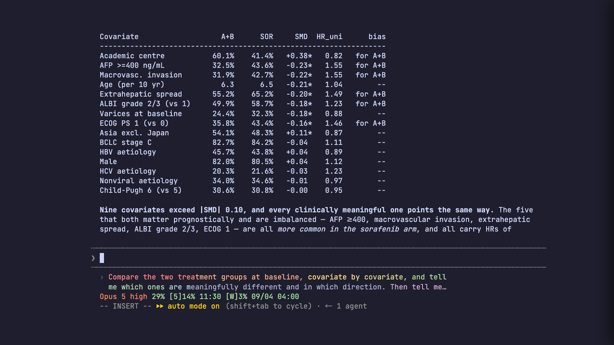
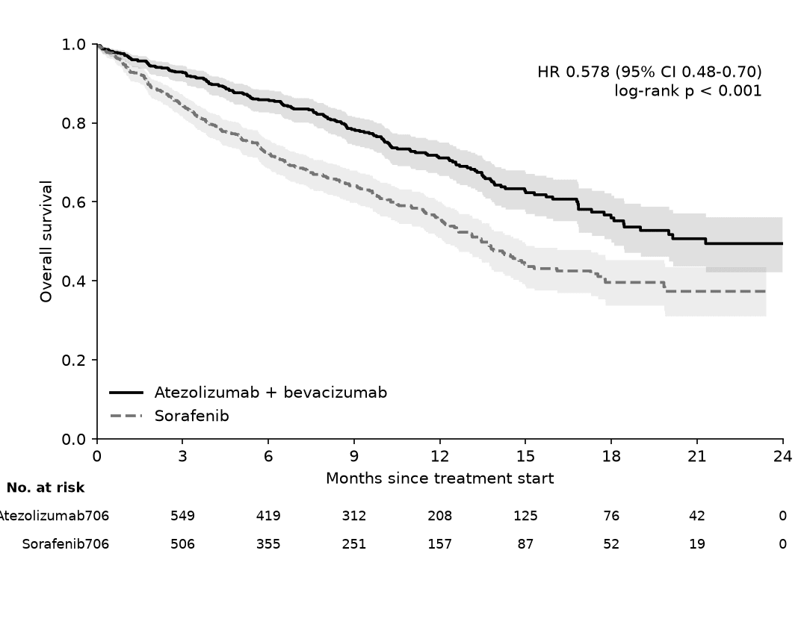
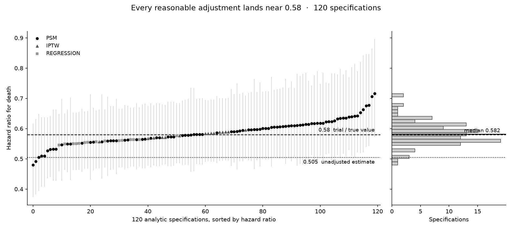

# IMbrave150 — Simulated Teaching Dataset

A **fully synthetic** patient-level dataset built to *recreate* the IMbrave150
phase-3 trial for teaching survival analysis. If a student is handed
`imbrave150_simulated.csv` and runs the standard methods (Kaplan-Meier,
log-rank, Cox proportional-hazards), they obtain numbers close to the
published trial.

> **Source study:** Finn RS, Qin S, Ikeda M, et al. *Atezolizumab plus
> Bevacizumab in Unresectable Hepatocellular Carcinoma.* N Engl J Med
> 2020;382:1894-1905. DOI [10.1056/NEJMoa1915745](https://doi.org/10.1056/NEJMoa1915745).
> Key figures below were taken from the article abstract *(according to PubMed)*.
>
> ⚠️ **Synthetic data.** No real patient is represented. Numbers are drawn from
> statistical models tuned to the published summaries — use for teaching only,
> never for clinical or research claims about the actual drugs.

[](https://imbrave150-talk.pages.dev/talk)

<sup>A real frame of the recorded session, 9:20 in. The sentence that produced
that table is still in the composer at the bottom. **[Play the whole
thing →](https://imbrave150-talk.pages.dev/talk)**</sup>

## Watch it · 看

Everything below is one study — ten messy hospital exports turned into a
written-up manuscript — shown three ways. **The terminal recording is the one
that matters.**

### ▶ The terminal recording — the real thing

| | |
|---|---|
| **<https://imbrave150-talk.pages.dev/talk>** | **The walkthrough. 33 min, 22 at 1.5×.** Data → cleaning → exploring → analysis → writing, as one continuous agent session. Twenty-two chapters. |
| <https://imbrave150-talk.pages.dev/talk-long> | The long version, 64 min: the same study with the arguments kept in — an ambiguous prompt moving the answer, 120 analytic paths, four independent reviewers. |

This is a **`.cast`, not a video**: a stream of terminal text, so it is 2.6 MB
rather than hundreds, the text stays selectable, and any line can be enlarged
to fill the screen. Speed, chapters and fullscreen are in the bar at the top.

Source: [`slides/cast/walk.cast`](slides/cast/walk.cast) ·
recorded by [`slides/tools/record_walkthrough.sh`](slides/tools/record_walkthrough.sh)

### The slides around it

| | |
|---|---|
| <https://imbrave150-talk.pages.dev/> | Landing page for all of the above |
| <https://imbrave150-talk.pages.dev/deck.pdf> | The 12-slide deck presented around the recording |
| <https://imbrave150-talk.pages.dev/deck-reference.pdf> | 43-slide reference edition |
| <https://imbrave150-talk.pages.dev/deck-backup.pdf> | The deck with a still frame from the recording after each signpost, for presenting without a browser |
| [Releases](https://github.com/htlin222/IMBrave150-mock/releases) | `imbrave150-slides-*.zip` — the presenter bundle: recordings, slides and the rehearsal script, offline |

### The older animated deck

<https://imbrave150-demo.pages.dev> — the same story as an animated HTML slide
deck ([`claude-demo/`](claude-demo/)). Made before the terminal recording
existed; kept because it stands on its own, but the recording is what to watch.

---

## Three ways to use this repo

| | What it is |
|---|---|
| **`live-demo/`** | **A 9-chapter, 26-mission guide an AI agent executes live, one mission at a time.** Open the repo and say *"follow the ./live-demo mission by mission"*. Every mission has hard-number acceptance checks (`live-demo/verify/`), a gotcha list drawn from a real run, and a presenter runbook. Goes from 10 raw hospital CSVs to a typeset preprint PDF. |
| **`slides/`** | **The talk.** A recorded terminal session of the whole workflow, the decks presented around it, and a verbatim rehearsal script. Built and released by CI; live at <https://imbrave150-talk.pages.dev>. |
| **`claude-demo/`** | A self-contained animated HTML slide deck of the same story (~60 min). Predates the recording. Open `claude-demo/index.html`. |
| **the dataset itself** | Two teaching layers (below) — use the CSVs and scripts directly for coursework. |

## Reproduce it

Everything here — the pooled cohort, the matched estimate, the figures, the
manuscript — was produced by asking an agent in ordinary sentences. Those
sentences are written down, and so is what came back.

| | |
|---|---|
| **[`docs/PROMPTS.md`](docs/PROMPTS.md)** | **The prompt list, verbatim.** Three routes: 32 guided missions, or the 14 prompts of the walkthrough, or the 18 of the long version. Generated from the recorder scripts, so it cannot drift from what actually ran. |
| [`docs/PIPELINE.md`](docs/PIPELINE.md) | What consumes what. How the synthetic data was manufactured, how ten exports become one estimate, and how the talk gets built and released. |
| [`docs/FILE-TREE.md`](docs/FILE-TREE.md) | Every tracked file and what it is for, plus the directories that only exist after something runs. Generated from `git ls-files`. |
| [`live-demo/reference-run/`](live-demo/reference-run/) | What one complete run produced: the eight result tables, and a checksum manifest of all 45 output files. Compare yours against it. |

The fastest way in, if you have an agent to hand:

```bash
git clone https://github.com/htlin222/IMBrave150-mock && cd IMBrave150-mock
make setup
# then open it in Claude Code and say:
#   follow the ./live-demo mission by mission
```

It executes one mission, runs that mission's acceptance check, tells you what
it found, and stops. You say `next`. Thirty-two times, and you have a preprint.

If you would rather skip the agent entirely, `make data && make analyze` runs
the reference implementations in about a minute.

| | |
|---|---|
|  |  |
| The matched estimate — the one that lands on the published 0.58. | All 120 alternative analyses. The conclusion does not depend on which one you pick. |

Both came out of the run in
[`live-demo/reference-run/`](live-demo/reference-run/), not out of the
reference scripts.

**Your numbers will not match to the last digit, and should not.** An agent
writes its own analysis code, and two runs make different defensible choices.
What holds every time: the unadjusted hazard ratio is far too flattering, the
matched one lands near 0.58, and none of 120 alternative specifications crosses
1.0. The tolerances are enforced in [`live-demo/verify/`](live-demo/verify/).

## Two teaching layers

1. **Randomised trial** (`imbrave150_simulated.csv`) — covariates balanced by
   randomisation; a single-covariate Cox recovers HR ≈ 0.58. *(this file)*
2. **Real-world meta-layer** (`hospitals/H01…H10.csv`) — 10 **separate**
   hospital files in 3 different EHR schemas; students **harmonise + pool** them,
   then run **propensity-score matching** on the confounded cohort and recover
   the same HR ≈ 0.58. See **[`MULTIHOSPITAL_PSM.md`](MULTIHOSPITAL_PSM.md)**.

## Files

| File | Purpose |
|------|---------|
| `imbrave150_simulated.csv` | Randomised dataset (501 patients × 35 variables) |
| `DATA_DICTIONARY.md` | Every column, type, units, and encoding |
| `generate_imbrave150.py` | The simulator (reproducible, `SEED=48`) |
| `analyze_imbrave150.py` | Reproduction check in Python (`lifelines`) |
| `analyze_imbrave150.R` | Same analysis in R (`survival`) |
| `search_seed.py` | How the calibrated seed was selected |
| `MULTIHOSPITAL_PSM.md` | **Meta-layer**: 10 hospitals → harmonise → PSM → survival |
| `hospitals/H01…H10_*.csv` | 10 per-hospital files in 3 EHR dialects (raw input) |
| `hospitals_meta.csv` | Per-hospital catalog (type / region / vendor / size) |
| `generate_multihospital.py` | Builds the 10 hospital files + answer key |
| `harmonize_hospitals.py` | Reads 10 files → harmonises → pooled cohort |
| `psm_imbrave150.py` / `.R` | Pool → PSM + balance + survival (Python / R) |
| `robustness_multiverse.py` | 120 analytic specs → HR distribution figure |
| `tmle_demo.py` | TMLE / AIPW (doubly robust) vs the true DGP estimand |

That is the dataset layer. For every other file in the repository — the guided
course, the recordings, the build tooling — see
**[`docs/FILE-TREE.md`](docs/FILE-TREE.md)**.

## Quick start

```bash
make setup      # uv venv + install requirements.txt   (or: pip install -r requirements.txt)
make data       # generate both datasets + pool the 10 hospitals
make analyze    # reproduce trial result + PSM + TMLE
make figure     # render the robustness figure

# R equivalents
Rscript analyze_imbrave150.R
Rscript psm_imbrave150.R
```

Datasets are regenerated deterministically (fixed seeds), so `make data` on any
machine reproduces the committed CSVs byte-for-byte.

## Does it reproduce the trial?

| Endpoint | Simulated | Published (Finn 2020) |
|----------|-----------|-----------------------|
| N (Atezo+Bev / Sorafenib) | 336 / 165 | 336 / 165 |
| **OS hazard ratio (death)** | **0.57** (95% CI 0.41–0.79) | **0.58** (0.42–0.79) |
| OS log-rank p | 7 × 10⁻⁴ | < 0.001 |
| 12-month OS (Atezo / Sora) | 70% / 58% | 67.2% / 54.6% |
| **PFS hazard ratio** | **0.61** (0.49–0.76) | **0.59** (0.47–0.76) |
| Median PFS (Atezo / Sora) | 6.9 / 4.4 mo | 6.8 / 4.3 mo |
| Objective response rate | 26% / 13% | 27.3% / 11.9% |
| Grade 3/4 AE | 60% / 55% | 56.5% / 55.1% |
| Grade 3/4 hypertension (Atezo) | 16% | 15.2% |

Baseline **Table 1** marginals (age, sex, region, ECOG, etiology HBV/HCV/nonviral,
BCLC stage, AFP≥400, MVI, EHS, Child-Pugh A5/A6) also reproduce the trial —
see `DATA_DICTIONARY.md`.

## Why it reproduces (the design, briefly)

- **2:1 randomisation, n=501** matches the trial's power structure.
- **Randomisation balances covariates** across arms, so the single-covariate
  Cox HR ≈ the covariate-adjusted HR — that is what lets `coxph(Surv ~ arm)`
  recover the headline result.
- Times-to-event are generated from a **proportional-hazards model** whose
  treatment coefficient *is* the published HR (0.58 for OS, 0.59 for PFS),
  with realistic prognostic effects layered on (AFP, MVI, EHS, ECOG, BCLC,
  ALBI) so multivariable Cox is also a genuine exercise.
- **Censoring** comes from staggered accrual + one administrative cutoff (the
  "primary analysis") — the realistic reason KM, not raw proportions, is
  required. Event counts are calibrated to the published ~29% vs ~39% deaths.

## Suggested teaching exercises

1. Plot Kaplan-Meier OS curves by arm; add the number-at-risk table.
2. Run the log-rank test and a univariable Cox model; interpret the HR and CI.
3. Estimate 6- and 12-month OS from the KM curve (not from raw death %).
4. Fit a multivariable Cox model; discuss why the arm effect barely moves
   after adjustment (→ randomisation).
5. Check the proportional-hazards assumption (Schoenfeld residuals,
   `cox.zph` in R).
6. Build the ORR 2×2 table and test with a chi-square / Fisher test.
7. Discuss coprimary endpoints and why medians can be "not reached".

---

## Using this repository

**Licence.** [MIT](LICENSE) for the code and the documentation, and the same
for the data — with the standing condition that the data are synthetic and may
not be used to support a claim about any therapy.

**Citation.** [`CITATION.cff`](CITATION.cff); GitHub renders a ready-made
citation from it in the sidebar. Cite
[Finn 2020](https://doi.org/10.1056/NEJMoa1915745) for anything clinical.

**Contributing.** [`CONTRIBUTING.md`](CONTRIBUTING.md). Three rules matter more
than the rest: no number that was not produced by a run, no citation that was
not verified against Crossref, and never commit `.env`. Also
[`CODE_OF_CONDUCT.md`](CODE_OF_CONDUCT.md).

**A run that did not reproduce is the most useful issue you can file** — see
the last section of `CONTRIBUTING.md` for what to include.

## Provenance and limits

- The dataset is simulated from the published *summary statistics* of Finn RS
  et al., *N Engl J Med* 2020;382:1894–1905
  ([10.1056/NEJMoa1915745](https://doi.org/10.1056/NEJMoa1915745)). No
  patient-level data from that trial, or any other, was used or is contained
  here.
- The agreement with the published hazard ratio is **by construction**. It
  demonstrates that the analysis recovers a known answer from a confounded
  cohort; it is not independent evidence of anything.
- The manuscript in [`slides/stage/manuscript.md`](slides/stage/manuscript.md)
  is a genuine output of a genuine run, and says on its face that its subject
  is synthetic. It is a demonstration of a writing and review workflow, not a
  paper.
- ⚠️ **No real patient is represented anywhere in this repository, and nothing
  in it is evidence about atezolizumab, bevacizumab or sorafenib.**
