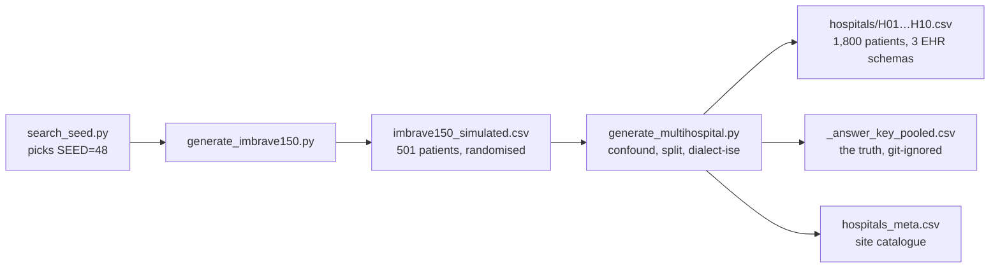
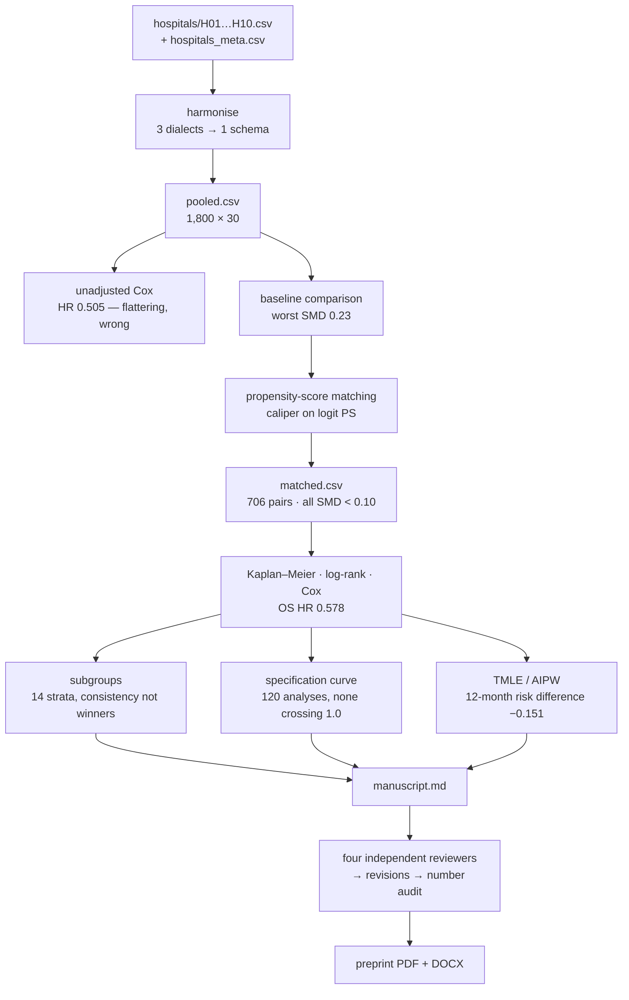
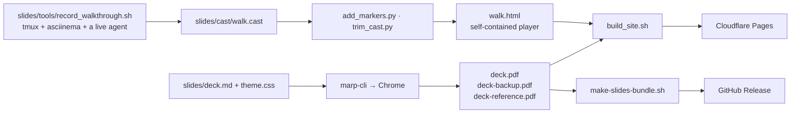

# The pipeline

Two things run in this repository, and it is worth keeping them apart:

1. **The data pipeline** — how the synthetic cohort was manufactured, and how
   ten messy hospital exports become one published estimate. This is the study.
2. **The talk pipeline** — how that study gets recorded, built into slides and
   published. This is the packaging.

Everything is deterministic where it can be (fixed seeds), and checked where it
cannot be (an agent writes its own code, so the outputs are checked against
tolerances rather than compared byte-for-byte).

---

## 1 · Manufacturing the data

Run once; the CSVs are committed, so most readers never need to.



| Step | Command | Produces |
|---|---|---|
| Choose the seed | `python search_seed.py` | prints the seed that makes the simulated trial land on the published summary statistics |
| Randomised trial | `python generate_imbrave150.py` | `imbrave150_simulated.csv` — 501 patients × 35 variables, 2:1 randomisation, HR ≈ 0.58 recoverable by a single-covariate Cox |
| Real-world layer | `python generate_multihospital.py` | `hospitals/H01…H10.csv`, `hospitals_meta.csv`, `_answer_key_pooled.csv` |
| Pool them | `python harmonize_hospitals.py` | `imbrave150_pooled.csv` — the reference harmonisation |

`make data` runs all of it. Regeneration is byte-identical on any machine: the
seeds are fixed and nothing is drawn from the clock.

**What the second step deliberately breaks**, because a tidy file teaches
nothing (details in [`MULTIHOSPITAL_PSM.md`](../MULTIHOSPITAL_PSM.md)):

| Injected mess | Where | Why it bites |
|---|---|---|
| Three EHR schemas (Alpha/Beta/Gamma) | different column names per family | `pd.concat` silently produces a table that is mostly `NaN` |
| Albumin in **g/L**, bilirubin in **µmol/L** | H02, H05, H08 (Beta) | no error is raised; the propensity model just goes wrong |
| AFP as a **≥400 flag only**, no continuous value | H03, H06, H09 (Gamma) | 35 % missing, and missing by *site*, not at random — a `dropna()` deletes 560 patients without saying so |
| Treatment assigned by site | academic H01 65.9 % atezo, community H07 34.7 % | hospital confounds both treatment and prognosis, and lives in a *different file* |
| Staggered accrual + one data cutoff | all sites | censoring is real, so raw death proportions are not survival |

---

## 2 · Ten hospitals → one estimate

This is the analysis, and it can be run three ways. All three consume the same
input — `hospitals/` plus `hospitals_meta.csv` — and nothing else.



### Route A — guided, 32 missions

`live-demo/`. An agent executes one mission at a time and stops; you drive it
with `next`. Each mission fixes its own output filenames so the acceptance
scripts can find them.

| Chapter | Missions | Consumes | Produces | Checked by |
|---|---|---|---|---|
| [00 setup](../live-demo/00-setup.md) | 0.1 | `hospitals/`, `hospitals_meta.csv` | `workspace/hospitals/` | `verify/ch00.py` |
| [01 aggregate](../live-demo/01-aggregate.md) | 1.1–1.3 | the ten CSVs | `harmonize.py`, `pooled.csv`, `site_join.py`, `site_profile.csv` | `verify/ch01.py` |
| [02 deconfound](../live-demo/02-deconfound.md) | 2.1–2.4 | `pooled.csv` | `naive.py`, `naive_hr.json`, `baseline_table1.csv`, `psm.py`, `matched.csv`, `balance.csv`, `figures/love_plot.*`, `figures/ps_overlap.*` | `verify/ch02.py` |
| [03 survival](../live-demo/03-survival.md) | 3.1–3.2 | `matched.csv` | `survival.py`, `km_summary.json`, `figures/km_os.*`, `figures/km_pfs.*` | `verify/ch03.py` |
| [04 subgroup](../live-demo/04-subgroup.md) | 4.1–4.2 | `matched.csv` | `subgroups.py`, `subgroups.csv`, `figures/forest.*` | `verify/ch04.py` |
| [05 robustness](../live-demo/05-robustness.md) | 5.1–5.3 | `pooled.csv` | `multiverse.py`, `multiverse.csv`, `figures/multiverse.*`, `tmle.py`, `tmle.json` | `verify/ch05.py` |
| [06 manuscript](../live-demo/06-manuscript.md) | 6.1–6.9 | every artifact above | `manuscript/manuscript.md`, `manuscript/refs.bib` | `verify/ch06.py` |
| [07 review](../live-demo/07-review.md) | 7.1–7.4 | the manuscript | `manuscript/review_log.csv`, revised manuscript | `verify/ch07.py` |
| [08 release](../live-demo/08-release.md) | 8.1–8.4 | the manuscript | `dist/*.pdf`, `*.docx`, preprint bundle | `verify/ch08.py` |

Everything lands in `live-demo/workspace/`, which is git-ignored and starts
empty. Compare a finished run against
[`live-demo/reference-run/`](../live-demo/reference-run/).

```bash
cd live-demo && ../.venv/bin/python verify/preflight.py --full   # before you start
cd live-demo && ../.venv/bin/python verify/run_all.py            # after you finish
```

### Route B/C — the recorded sessions

The same analysis driven by a flat list of prompts, no missions and no
acceptance scripts — this is what the recordings show. The prompts are in
[`PROMPTS.md`](PROMPTS.md).

### Route D — the reference scripts, no agent at all

If you only want the statistics, the finished implementations are in the
repository root and take about a minute:

```bash
make setup && make data && make analyze && make figure
```

| Script | Does | Writes |
|---|---|---|
| `analyze_imbrave150.py` / `.R` | reproduces the randomised-trial result | stdout |
| `harmonize_hospitals.py` | 10 dialects → one table | `imbrave150_pooled.csv` |
| `psm_imbrave150.py` / `.R` | matching, balance, matched survival | stdout |
| `robustness_multiverse.py` | 120 specifications | `robustness_multiverse_results.csv`, `robustness_multiverse.png` |
| `tmle_demo.py` | G-computation, IPTW, AIPW, TMLE vs the true DGP | stdout |

These are the **reference solutions**. If you are running Route A, do not read
them until you have tried the mission yourself — that is what the ⛔ rules in
[`live-demo/README.md`](../live-demo/README.md) are about.

### The result, whichever route

| Estimate | Value | Reading |
|---|---|---|
| Unadjusted OS HR | 0.505 (0.427–0.597) | what you get if you pool and compare. Too good. |
| Matched OS HR | **0.578** (0.479–0.698) | after removing the site-driven confounding |
| Published trial | **0.58** (0.42–0.79) | Finn 2020, *NEJM* 382:1894 |
| 120 specifications | median 0.582, none crossing 1.0 | the conclusion does not depend on the analyst's choices |
| TMLE 12-month risk difference | −0.151 vs true −0.154 | a doubly robust estimator lands on the truth; the naive one (−0.227) does not |

⚠️ Synthetic data. The agreement with Finn 2020 is by construction — it
demonstrates that the *method* recovers a known answer, and is not evidence
about any drug.

---

## 3 · Turning it into a talk



| Command | Does |
|---|---|
| `make -C slides pdf` | builds all three decks, then rasterises them and **fails if any slide overflowed** — Marp clips silently otherwise |
| `make -C slides walk` | re-records the walkthrough. Takes as long as the recording. |
| `slides/tools/build_site.sh` | assembles `slides/site/` from the players, the PDFs and the notes |
| `slides/tools/deploy_site.sh` | pushes it to Cloudflare Pages, reading credentials from `.env` |
| `scripts/make-slides-bundle.sh` | the offline presenter zip |
| `scripts/make-live-demo-bundle.sh` | the student download: `live-demo/` plus the data |

### CI

| Workflow | Trigger | Does |
|---|---|---|
| [`slides.yml`](../.github/workflows/slides.yml) | push to `main`, tag `slides-v*` | rebuild the decks, assert no overflow, publish a release on a tag |
| [`deploy-talk.yml`](../.github/workflows/deploy-talk.yml) | push touching `slides/` | rebuild and deploy the site |
| [`release-live-demo.yml`](../.github/workflows/release-live-demo.yml) | tag `live-demo-v*` | package and release the course bundle |
| [`docs.yml`](../.github/workflows/docs.yml) | push, PR | assert `docs/PROMPTS.md` and `docs/FILE-TREE.md` are regenerated from source |

There is deliberately no `paths:` filter on the release workflows' `push`
trigger: GitHub requires branch/tag **and** path filters to both match, so a
tag that happens not to touch the filtered path would never release, and
"pushed a tag, got no release" is the worst kind of silent failure.

---

## Environment

```bash
make setup      # uv venv .venv --python 3.12  +  requirements.txt
```

Versions in [`requirements.txt`](../requirements.txt) are pinned hard, and one
pin is load-bearing: `lifelines==0.30.0` with `numpy==2.5.1` makes
`lifelines.plotting.add_at_risk_counts()` raise `TypeError`. That is not a bug
to fix — Mission 3.2 teaches the manual replacement, and relaxing the pin
deletes the lesson.

Chapter 08 additionally needs `pandoc`, `tectonic` and `rsvg-convert`.
Recording needs `tmux`, `asciinema`, `presenterm` and `bat`.
