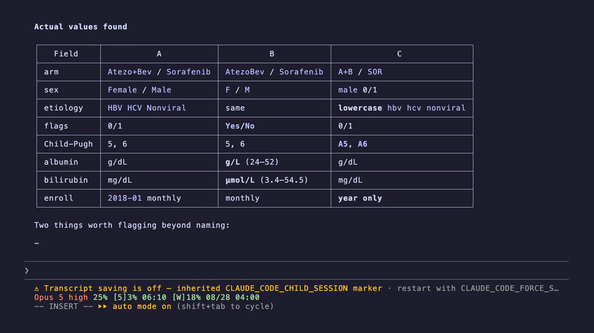
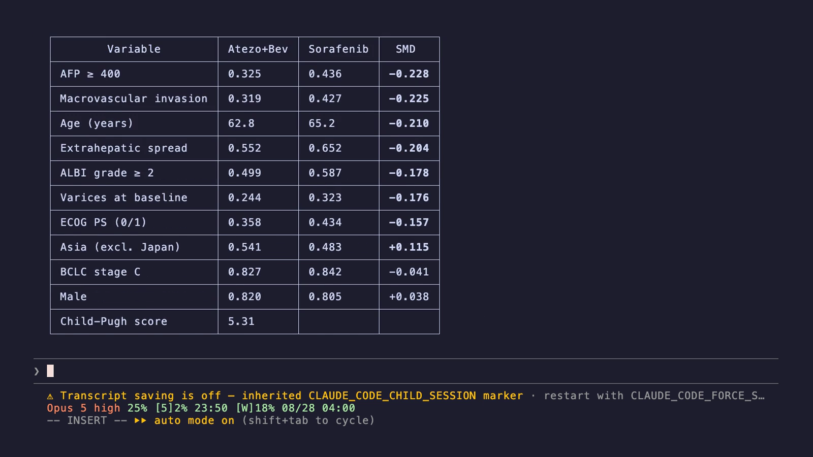
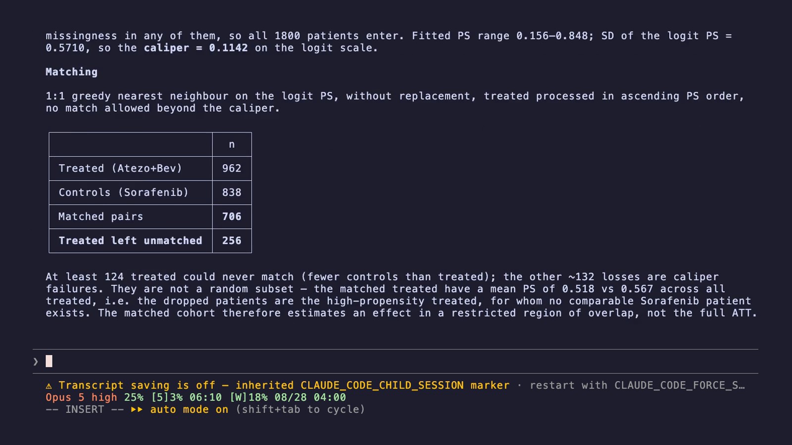
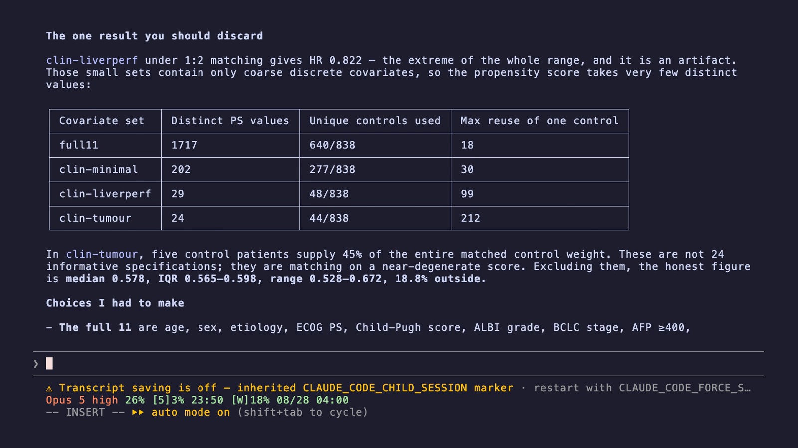
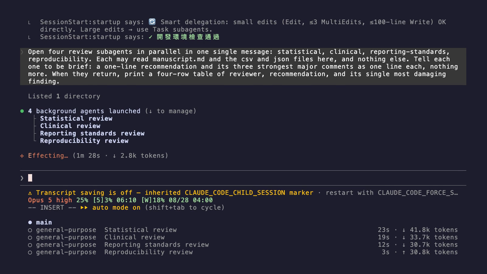

<!-- _class: title -->
<!-- _paginate: false -->

# Mission by Mission

Driving an AI coding agent, live — from ten messy hospital exports to a result you can audit. <em>Backup edition: every step shown as recorded session.</em>

Hsieh-Ting Lin, MD　林協霆

Department of Medical Oncology　腫瘤內科部 Koo Foundation Sun Yat-Sen Cancer Center　和信治癌中心醫院

---

## Disclaimer and Conflict of Interest

-  **The data are entirely synthetic**
  - Simulated from the published summaries of the IMbrave150 trial1
  - No real patient is represented; no record comes from any chart
  - Nothing here is evidence about atezolizumab, bevacizumab or sorafenib
-  **What this talk is about**
  - How to instruct an agent so that its output can be checked
  - The hazard ratio is a teaching target, not a finding
-  **Conflict of interest**
  - No financial or non-financial conflict; no industry funding
  - No relationship with any AI vendor

<!-- _footer: "1 Finn RS, Qin S, Ikeda M, et al. Atezolizumab plus bevacizumab in unresectable hepatocellular carcinoma. <em>N Engl J Med</em>. 2020;382(20):1894-1905. doi:10.1056/NEJMoa1915745" -->

---

## What an Agent Is, and Is Not

-  **A chatbot** answers you
  - You paste data in, it writes text back. Nothing on your disk changes.
-  **An agent** works on your machine
  - It reads your files, writes scripts, runs them, reads the error, tries again
  - It keeps going until a condition you set is met
-  **So the hard part moves**
  - Not *"can it write the code"* — it can
  - But *"how do I know the answer it handed me is right"*
-  That question is the whole talk

---

<!-- _class: cols -->

## The Difference One Sentence Makes

###  What most people type

> Analyse this data and tell me
> if the treatment works.

- Picks its own method
- Picks its own file names
- Different answer every run
- Nothing to check it against

###  What I will type

> Fit a Cox model on treatment
> alone. Write `naive_hr.json`
> with `hr`, `ci_low`, `ci_high`.
> Then tell me in one sentence
> what you would conclude.

- Named file, named fields
- Reruns identically
- A script can grade it

---

## Ten Hospitals, Three Dialects

-  **What this step does**
  - Ten CSV exports, three incompatible record systems, into one table

> Group the ten files by their column
> fingerprint, not by filename. Report the
> actual values with `unique()`. Convert to
> one schema, names and units fixed. Never
> drop a row for missingness. Then attach
> each hospital's type and region.

-  **What to watch**
  - Albumin is in g/L at some sites, g/dL at others — a tenfold error waiting
  - **1,800 patients, 962 vs 838.** Three sites record no AFP at all

<!-- _footer: "live-demo · Missions 1.1–1.3　·　Slides and repository: github.com/htlin222/IMBrave150-mock" -->

---

<!-- _class: shot -->
<!-- _footer: "" -->

## recordedTen hospitals, three dialects

It built the comparison table itself and found the trap: <strong>dialect B stores albumin in g/L and bilirubin in µmol/L</strong>.

---

## The Unadjusted Answer Is Lying

-  **What this step does**
  - Compares the two arms with no adjustment whatsoever

> Fit a Cox model on treatment alone.
> Write `naive_hr.json`. Then tell me in one
> sentence what you would conclude from
> this number by itself.

-  **What to watch**
  - **HR 0.505** — the drug looks better than the trial ever claimed
  - Then: **8 of 11 baseline factors differ**, every one favouring the treated arm
  - Believe the first number for thirty seconds. That is the point

<!-- _footer: "live-demo · Missions 2.1–2.2" -->

---

<!-- _class: shot -->
<!-- _footer: "" -->

## recordedThe unadjusted answer

<strong>HR 0.505</strong> — then the balance table. Every serious imbalance leans the same way, toward the treated arm.

---

## Make the Two Arms Comparable

-  **What this step does**
  - Pairs each treated patient with an untreated patient of similar profile

> Match 1:1 on the propensity score, nearest
> neighbour, no replacement. Take the treated
> in **ascending** score order. Do not force a
> match outside the caliper. Report how many
> treated were left unmatched.

-  **What to watch**
  - **706 pairs. 256 treated patients found no match** — that is honesty, not failure
  - **HR 0.578.** The randomised trial reported **0.58**1

<!-- _footer: "live-demo · Missions 2.3–3.1　·　1 Finn RS, et al. <em>N Engl J Med</em>. 2020;382(20):1894-1905. doi:10.1056/NEJMoa1915745" -->

---

<!-- _class: shot -->
<!-- _footer: "" -->

## recordedMatching, and what it costs

<strong>706 pairs, 256 treated left unmatched.</strong> It separates the 124 who could never match from the 132 caliper failures.

---

## Try to Break Your Own Result

-  **What this step does**
  - Re-runs the same data through every defensible analysis, not the one that worked

> Hold the data fixed. Vary only the analytic
> choices: 15 covariate sets × 8 adjustment
> methods = 120 runs. Report the median, the
> spread, and **how many landed outside the
> range I was hoping for.**

-  **What to watch**
  - The median lands on **0.58** every time. The **spread does not** — about a
    third of the runs fall outside 0.55–0.61
  - Nothing crosses 1.0. The direction is solid; the third decimal is not

<!-- _footer: "live-demo · Missions 5.1–5.2　·　Steegen S, Tuerlinckx F, Gelman A, Vanpaemel W. Increasing transparency through a multiverse analysis. <em>Perspect Psychol Sci</em>. 2016;11(5):702-712. doi:10.1177/1745691616658637" -->

---

<!-- _class: shot -->
<!-- _footer: "" -->

## recorded120 analytic paths

It found its own outlier: the 0.822 run matches on a near-degenerate score that reuses one control <strong>212 times</strong>.

---

## Let It Review Its Own Manuscript

-  **What this step does**
  - Opens four reviewers at once, each blind to the other three

> Open four reviewers in parallel: statistical,
> clinical, reporting standards, reproducibility.
> Each may read the manuscript and the output
> files **only**. Each must raise at least three
> major comments. Found none? Read it again.

-  **What to watch**
  - Four windows moving at once — that picture is the point
  - The reproducibility reviewer re-checks **every number against its source file**

<!-- _footer: "live-demo · Mission 7.1" -->

---

<!-- _class: shot -->
<!-- _footer: "" -->

## recordedFour reviewers, blind to each other

<strong>Four background agents launched</strong> from one message, each reading the manuscript and the output files, none seeing the others.

---

<!-- _class: cols -->

## The Whole Path, on One Slide

###  What we just did

- 10 CSVs, 3 record systems
- → 1,800 patients, one table
- → **HR 0.505** unadjusted
- → **HR 0.578** matched
- → 120 re-runs: median **0.58**
- → four reviewers, blind

###  The benchmark

- The randomised trial reported
  **HR 0.58**1
- The gap between 0.505 and
  0.578 was confounding —
  and it was recoverable
- Nothing above was typed
  by hand except the prompts

<!-- _footer: "1 Finn RS, Qin S, Ikeda M, et al. Atezolizumab plus bevacizumab in unresectable hepatocellular carcinoma. <em>N Engl J Med</em>. 2020;382(20):1894-1905. doi:10.1056/NEJMoa1915745" -->

---

## Four Habits Worth Stealing

-  **Name the file and the fields**
  - "Save the results" cannot be checked. `naive_hr.json` with `hr`, `ci_low` can
-  **Write your known traps into the instructions**
  - Every constraint you state is a debugging session you do not have on stage
-  **Let something else decide pass or fail**
  - A script you did not write this turn, that the agent cannot edit
-  **Tell it where to stop**
  - Otherwise it finishes the whole project in one turn — correct, and unreviewable

---

<!-- _class: title -->
<!-- _paginate: false -->

# Thank You

Every mission, prompt and acceptance script: github.com/htlin222/IMBrave150-mock

Hsieh-Ting Lin, MD　林協霆

Department of Medical Oncology　腫瘤內科部 Koo Foundation Sun Yat-Sen Cancer Center　和信治癌中心醫院

